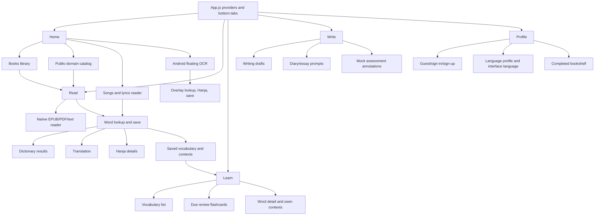

# Fluent Fable Pencil Handoff

This is the source packet to give Pencil enough context to redesign or extend the Fluent Fable UX/UI. Start here, then ingest the source files listed below in order.

Fluent Fable is a mobile reading and language-learning app. Its core idea is simple: users learn Korean and other supported languages by reading real text, tapping words in context, saving useful vocabulary, and reviewing only when reading has not exposed the word enough.

For a current-state inventory of every major feature, screen state, and user interaction, read [`FEATURES_AND_INTERACTIONS.md`](FEATURES_AND_INTERACTIONS.md) before redesigning flows.

## Visual References

The current screenshots in `docs/pencil-handoff/visuals/` are the primary visual references for Pencil. They are all 1080 x 2400 PNGs and are named by screen/state. Use these instead of the old showcase GIF.

### Primary Visual Anchors

| Home library | Reader lookup | Learn review |
| --- | --- | --- |
|  |  |  |

| Writing review | Profile | OCR overlay |
| --- | --- | --- |
|  |  |  |

### Complete Screenshot Index

| Area | Screenshot | Shows |
| --- | --- | --- |
| Home | [`[Home] My books.png`](<visuals/[Home] My books.png>) | Main books library state. |
| Home | [`[Home] Public Domain.png`](<visuals/[Home] Public Domain.png>) | Public-domain catalog and sorting. |
| Home | [`[Home] Preview Book.png`](<visuals/[Home] Preview Book.png>) | Book detail/preview actions. |
| Home | [`[Home] Songs Tab.png`](<visuals/[Home] Songs Tab.png>) | Songs tab inside Home. |
| Home | [`[Home] Adding Song.png`](<visuals/[Home] Adding Song.png>) | Add-song modal/form. |
| Read | [`[Read] Main.png`](<visuals/[Read] Main.png>) | Reader default state. |
| Read | [`[Read] Fullscreen.png`](<visuals/[Read] Fullscreen.png>) | Reader fullscreen mode. |
| Read | [`[Read] Reader Settings.png`](<visuals/[Read] Reader Settings.png>) | Reader settings dropdown. |
| Read | [`[Read] Table of Contents.png`](<visuals/[Read] Table of Contents.png>) | Table of contents dropdown. |
| Read | [`[Read] Definition Panel.png`](<visuals/[Read] Definition Panel.png>) | Dictionary lookup sheet. |
| Read | [`[Read] Translation Panel.png`](<visuals/[Read] Translation Panel.png>) | Translation sheet. |
| Read | [`[Read] Hanja Panel.png`](<visuals/[Read] Hanja Panel.png>) | Hanja detail panel. |
| Learn | [`[Learn] Word Detail.png`](<visuals/[Learn] Word Detail.png>) | Saved word detail/context view. |
| Learn | [`[Learn] Flashcard.png`](<visuals/[Learn] Flashcard.png>) | Flashcard front/review state. |
| Learn | [`[Learn] Flashcard Backside.png`](<visuals/[Learn] Flashcard Backside.png>) | Flashcard backside/answer state. |
| Write | [`[Write] Main.png`](<visuals/[Write] Main.png>) | Writing list. |
| Write | [`[Write] Empty Entry.png`](<visuals/[Write] Empty Entry.png>) | Empty/new writing state. |
| Write | [`[Write] Entry Text Editor.png`](<visuals/[Write] Entry Text Editor.png>) | Writing editor. |
| Write | [`[Write] AI Assessment.png`](<visuals/[Write] AI Assessment.png>) | Reviewed entry and assessment UI. |
| Profile | [`[Profile] Main.png`](<visuals/[Profile] Main.png>) | Profile overview. |
| Profile | [`[Profile] Log In Panel.png`](<visuals/[Profile] Log In Panel.png>) | Auth/sign-in panel. |
| Profile | [`[Profile] Bookshelf Book Example.png`](<visuals/[Profile] Bookshelf Book Example.png>) | Bookshelf spine interaction. |
| Profile | [`[Profile] Book More Info.png`](<visuals/[Profile] Book More Info.png>) | Profile book tooltip/detail state. |
| Song | [`[Song] Main.png`](<visuals/[Song] Main.png>) | Song reader default state. |
| Song | [`[Song] Settings.png`](<visuals/[Song] Settings.png>) | Song reader settings. |
| Song | [`[Song] Definition Panel.png`](<visuals/[Song] Definition Panel.png>) | Song dictionary lookup sheet. |
| Song | [`[Song] Translation Panel.png`](<visuals/[Song] Translation Panel.png>) | Song translation sheet. |
| OCR | [`[OCR] Activated.png`](<visuals/[OCR] Activated.png>) | OCR scanner active state. |
| OCR | [`[OCR] Word Detection.png`](<visuals/[OCR] Word Detection.png>) | OCR text detection overlay. |
| OCR | [`[OCR] Definnition Panel.png`](<visuals/[OCR] Definnition Panel.png>) | OCR dictionary panel. Filename typo is preserved. |
| OCR | [`[OCR] Hanja Panel.png`](<visuals/[OCR] Hanja Panel.png>) | OCR Hanja detail panel. |
| OCR | [`[OCR] Flashcard Setting.png`](<visuals/[OCR] Flashcard Setting.png>) | OCR-related flashcard/settings state. |
| OCR | [`[OCR] Closing Overlay.png`](<visuals/[OCR] Closing Overlay.png>) | OCR overlay close/dismiss state. |

App icon:

Translator assets:

## Product Feel

Fluent Fable should feel like a quiet reading desk, not a quiz game. The current UI uses warm paper colors, soft book-cover tones, serif display type, compact controls, and restrained orange/brown accents. The design language should support long reading sessions, quick lookup, and calm vocabulary management.

The app should feel:

- Literary and study-focused.
- Warm, tactile, and paper-like.
- Fast when selecting text, looking up words, saving vocabulary, or continuing a book.
- Low-friction for guest users, but trustworthy when cloud sync and account decisions appear.
- Supportive of context-based learning instead of heavy gamification.

Avoid making the app feel like a generic flashcard product. Reading is the primary action; review, writing, songs, and OCR are supporting tools.

## App Map

## Primary User Flows

1. A guest or signed-in user opens Home and continues the current book, imports an EPUB/PDF, adds a public-domain book, opens saved song lyrics, or starts the Android OCR scanner.
2. In Read, the user reads with a native paginated reader. The header shows title, author, progress, table of contents, fullscreen, and reader settings.
3. The user taps a word for dictionary lookup or long-presses a selection for translation. The bottom lookup sheet can save/unsave words, translate text, and open Hanja details.
4. Saved words appear in Learn with filters, maturity states, seen-in-context details, favorites, bulk delete, and flashcard reviews.
5. In Write, the user creates or reviews Korean writing entries, chooses prompts, formats drafts, and sees inline mock assessment annotations.
6. In Profile, the user sees identity, completed bookshelf, language/profile preferences, interface language, and auth actions.
7. When local guest data meets account sync, the local data decision modal blocks cloud sync until the user chooses to save, merge, keep guest, start fresh, or discard.

## Feature Inventory

### Home

- Hero copy frames the product around reading and collecting meaningful words.
- Continue-reading card shows current book, author, progress, and cloud/download state.
- Books/Songs segmented area switches the library mode.
- Book filters: favorites, my books, public domain.
- Public-domain browser supports sorting by title, author, length, and genre.
- Book grid uses generated/custom covers, progress rails, download badges, and overflow menus.
- Book preview supports read/download/add-to-library, favorite, mark completed, edit, reset, and delete.
- Import flow handles EPUB/PDF metadata, cover options, language, title, author, word count, file size, and cloud upload.
- Songs support manual lyric storage and a song reader where terms can be saved.
- Android OCR toggle manages overlay permission, screen-capture permission, floating widget state, and scan feedback.

### Read

- Native reader supports EPUB, PDF extraction, and public-domain text packages.
- Header shows title, author, progress, table of contents, fullscreen, and settings.
- Fullscreen hides bottom tab chrome and keeps only a small exit control.
- Reader settings include font size, line spacing, and dark mode.
- Loading and error states include opening reader, preparing smart highlights, no book selected, retry, and file-size context.
- Smart highlights use saved words and preprocessed book surfaces.
- Tap word opens dictionary lookup.
- Long press opens translation mode.
- Lookup sheet animates from the bottom or top depending on placement/fullscreen.
- Dictionary lookup shows stems, definitions, part of speech, romanization/IPA/etymology when available, related known words, Hanja, and save/unsave.
- Translation view uses the same sheet with a translation header and close behavior.
- Hanja detail drill-down supports multiple characters from a word.
- Reading progress and reading time are recorded locally and synced when possible.

### Learn

- Summary card emphasizes reading-first learning: matured through reading, waiting for another encounter, not seen lately.
- Review action is secondary and depends on due words.
- Filters: starred, recently saved, maturity, not seen lately, most seen.
- Vocabulary rows show word, definition, proficiency/maturity, seen count, source, dates, favorite and priority concepts.
- Long press enters selection mode for bulk delete.
- Word detail modal shows saved context sentences and related Hanja details.
- Flashcard modal supports front-card settings: show Hanja, show definition, show related words.
- Flashcard outcomes are Hard, Okay, Easy and update review scheduling.

### Write

- Writing list has filters: all, free, diary, essay.
- Entries have status: draft, submitted, reviewed.
- Empty state opens new entry creation.
- Current top "+ New" button is disabled in code, while the empty-state "New Entry" opens a draft. Decide whether the final design should enable the top action consistently.
- Editor supports entry type, prompt picker, title, body, and simple formatting buttons.
- Detail/review view shows reviewed status, character count, words to translate, highlighted annotations, inline corrections, and an annotation sheet.
- Assessment behavior is currently mock data, but the UI should be designed as if real feedback will land there.

### Profile And Auth

- Guest mode keeps local reading data and offers sign in/sign up.
- Signed-in mode shows account identity, username edit, and logout.
- Bookshelf visualizes completed books as spines sized by estimated page count.
- Preferences include language profile, interface language, notifications, reading level, and appearance.
- Language profiles can be added for supported learning languages.
- Interface language picker supports the dictionary/interface language set.
- Auth supports email/password, Google, and Apple on iOS.
- Local data decision modal appears before cloud sync resumes when guest or legacy data needs an ownership choice.

### OCR Overlay

- Android only.
- User starts OCR from Home.
- Permission sequence: display-over-other-apps, then screen capture.
- Floating bubble scans the current screen.
- OCR result overlay lets the user select detected text, request lookup, save words, open Hanja detail, and toggle related-known-word links.
- The overlay uses the same dictionary/cache/Hanja logic as in-app lookup where possible.

## Design System Notes

Core tokens are in `frontend/theme/`.

| Role | Value | Notes |
| --- | --- | --- |
| Warm app background | `#f5f4f0` | Global warm base. |
| Home/Profile warm background | `#ece4d6` | Main library/profile paper tone. |
| Surface | `#fcfbf7`, `#faf6ee`, `#ffffff` | Cards, sheets, and panels. |
| Muted surface | `#f0ece4`, `#f2ecdf` | Secondary controls and inactive areas. |
| Border | `#ddd5c8`, `#e4dac6` | Soft paper borders. |
| Main text | `#1a1a1a`, `#2c2620` | Dark warm ink. |
| Muted text | `#6f675d`, `#766a59`, `#978e81` | Secondary copy and metadata. |
| Global accent | `#c87d00` | Lookup and shared accent. |
| Home accent | `#b8552e` | Library CTAs and active tabs. |
| Success | `#2f7d4c` | Matured/easy/progress states. |
| Warning | `#b57618` | Waiting/okay/review states. |
| Danger | `#b64f44` | Delete/hard/error states. |

Typography:

- Sans: DM Sans for UI text.
- Display: Fraunces for literary titles and hero text.
- Korean serif: Noto Serif KR for Korean text when needed.
- Main screen titles are around 24-30 px.
- Compact labels are 10-13 px.
- Reader body is adjustable from 12-30 px in current controls.

Shape and spacing:

- Shared radii include 8, 12, 16, 22, 30, and pill.
- Existing cards often use 16-22 px radius.
- Bottom tab height is 72 px.
- Main content max width is 560 px where constrained.
- Panels are soft, lightly shadowed, and bordered rather than high-contrast.

## Files Pencil Should Ingest

### Start Here

| File | Why it matters |
| --- | --- |
| `README.md` | Product summary and original feature intent. |
| `frontend/README.md` | Historical notes, completed ideas, and older UX priorities. |
| `docs/pencil-handoff/README.md` | This UX/UI brief and source map. |
| `docs/pencil-handoff/FEATURES_AND_INTERACTIONS.md` | Current feature and interaction inventory for design agents. |
| `docs/pencil-handoff/visuals/*.png` | Current screenshot set; primary source for existing visual state and UI density. |
| `docs/local-data-ownership-inventory.md` | Inventory of guest/account-owned local data. |
| `docs/auth-local-data-privacy-guide.md` | Privacy and data-ownership behavior around auth. |
| `docs/local-data-privacy-regression-matrix.md` | Edge cases for data ownership and sync decisions. |

### Navigation And App Shell

| File | Why it matters |
| --- | --- |
| `frontend/App.js` | Providers, app readiness, sync gates, bottom-tab navigation, reader fullscreen tab hiding. |
| `frontend/components/shared/TabBar.js` | Bottom tab icons, labels, active/inactive colors, and tab height. |
| `frontend/contexts/AppContext.js` | Global dictionary mode, target/native/interface language, active profile, and preference sync. |
| `frontend/contexts/LocalOwnerContext.js` | Sync/ownership state exposed to screens. |
| `frontend/hooks/useAppSetup.js` | App startup, book loading, DB setup, and initial state. |
| `frontend/hooks/useAuth.js` | Supabase auth state and account operations. |
| `frontend/hooks/useTranslation.js` | Translation hook used by all UI strings. |
| `frontend/services/interfaceLanguage.js` | Runtime interface language used by lookup and overlay flows. |
| `frontend/services/profileScope.js` | Active language profile defaults and runtime profile behavior. |

### Screen Entry Points

| File | Why it matters |
| --- | --- |
| `frontend/screens/Home.js` | Library, public-domain catalog, import/edit flows, songs, OCR toggle, and book previews. |
| `frontend/screens/Read.js` | Reader layout, lookup layer, fullscreen, settings, TOC, progress, and native reader integration. |
| `frontend/screens/Learn.js` | Vocabulary dashboard, filters, detail modal, selection mode, and flashcard review launch. |
| `frontend/screens/Write.js` | Writing list, editor, prompt picker, mock review UI, annotation sheet. |
| `frontend/screens/Profile.js` | Identity, bookshelf, preferences, auth entry points, language/profile pickers. |
| `frontend/screens/Auth.js` | Email, Google, Apple auth UI. |
| `frontend/screens/ScreenshotOcr.js` | Secondary OCR screen reference; not mounted in the current tab navigator. |

### Home, Books, Songs, And OCR

| File | Why it matters |
| --- | --- |
| `frontend/components/Home/BookList.js` | Older/simple book list component; useful as a secondary reference. |
| `frontend/components/Songs/SongReader.js` | Lyrics reader, line selection, term saving, and song-specific reading UI. |
| `frontend/services/publicDomainBooks.js` | Public-domain package model and text-to-chapter logic. |
| `frontend/assets/data/public-domain/catalog.js` | Public-domain book metadata shown in Home. |
| `frontend/services/bookCoverColors.js` | Generated cover palette behavior. |
| `frontend/services/bookCloudSync.js` | Cloud book shape, upload/download/progress metadata. |
| `frontend/services/songCloudSync.js` | Song persistence shape and cloud sync. |
| `frontend/services/songStorageLimits.js` | Local song storage constraints and related error states. |
| `frontend/services/epubMetadata.js` | EPUB title/author/word-count metadata extraction. |
| `frontend/services/pdfMetadata.js` | PDF metadata and cover/page handling. |
| `frontend/modules/screen-ocr-overlay/src/index.js` | JS API for Android floating OCR. |
| `frontend/services/overlayLookup.js` | OCR overlay lookup, save, Hanja, and enrichment behavior. |
| `frontend/services/dictionaryLookup.js` | Shared overlay dictionary result shape, save, and unsave behavior. |
| `frontend/modules/screen-ocr-overlay/android/src/main/java/expo/modules/screenocroverlay/FloatingWidgetController.kt` | Floating OCR bubble/result overlay behavior. |
| `frontend/modules/screen-ocr-overlay/android/src/main/java/expo/modules/screenocroverlay/OcrResultOverlayView.kt` | OCR result selection overlay UI logic. |
| `frontend/modules/screen-ocr-overlay/android/src/main/java/expo/modules/screenocroverlay/ScreenOcrOverlayService.kt` | OCR service states and permission/capture lifecycle. |
| `frontend/modules/screen-ocr-overlay/android/src/main/java/expo/modules/screenocroverlay/ScreenCaptureSession.kt` | Screen capture and OCR extraction pipeline. |
| `frontend/modules/screen-ocr-overlay/android/src/main/java/expo/modules/screenocroverlay/OcrSerializer.kt` | OCR result data shape. |
| `frontend/modules/screen-ocr/src/index.js` | Secondary screen OCR module JS bridge. |
| `frontend/modules/screen-ocr/android/src/main/java/expo/modules/screenocr/ScreenOcrModule.kt` | Secondary screen OCR native module. |

### Reader And Lookup

| File | Why it matters |
| --- | --- |
| `frontend/components/Read/TopSection/TopSection.js` | Animated lookup sheet, dictionary/translation switching, placement, height behavior. |
| `frontend/components/Read/TopSection/DictionaryContent.js` | Dictionary result UI, save/unsave, Hanja triggers, related known words, cache/live lookup states. |
| `frontend/components/Read/TopSection/TranslationContent.js` | Translation display behavior. |
| `frontend/components/Read/TopSection/Hanja.js` | Hanja row/pill rendering. |
| `frontend/components/Read/TopSection/HanjaDetails.js` | Hanja detail modal/drill-down. |
| `frontend/components/Read/TocDrawer.js` | Table of contents dropdown. |
| `frontend/components/Read/BottomSection.js` | Legacy/alternate bottom-section lookup behavior; useful for historical intent. |
| `frontend/modules/native-epub-reader/src/NativeEpubReaderView.js` | JS bridge for the native reader. |
| `frontend/modules/native-epub-reader/android/src/main/java/expo/modules/nativeepubreader/EpubPageView.kt` | Native page rendering and selection behavior. |
| `frontend/modules/native-epub-reader/android/src/main/java/expo/modules/nativeepubreader/EpubPaginator.kt` | Pagination model. |
| `frontend/modules/native-epub-reader/android/src/main/java/expo/modules/nativeepubreader/EpubPageAdapter.kt` | Reader page adapter behavior. |
| `frontend/modules/native-epub-reader/android/src/main/java/expo/modules/nativeepubreader/NativeEpubReaderModule.kt` | Native reader module bridge. |
| `frontend/modules/native-epub-reader/android/src/main/java/expo/modules/nativeepubreader/PdfDocumentExtractor.kt` | PDF extraction behavior. |
| `frontend/modules/native-epub-reader/android/src/main/java/expo/modules/nativeepubreader/PageContent.kt` | Page content data shape. |
| `frontend/services/api/preprocessChapter.js` | Chapter preprocessing request for smart highlights. |
| `frontend/services/api/koreanDictionary.js` | Dictionary API integration. |
| `frontend/services/api/hanjaRelated.js` | Related Hanja/known word lookup. |
| `frontend/services/api/googleTranslate.js` | Translation API integration. |
| `frontend/services/api/stemWord.js` | Stemming API integration. |
| `frontend/services/api/client.js` | API client base behavior. |
| `backend/main.py` | FastAPI endpoints for stemming, preprocessing, dictionary, and related lookup. |

### Learning And Writing

| File | Why it matters |
| --- | --- |
| `frontend/components/Learn/Flashcard.js` | Flashcard modal, front-card settings, and Hard/Okay/Easy actions. |
| `frontend/components/Learn/WordRow.js` | Saved vocabulary row component, if used by current or future Learn layouts. |
| `frontend/components/Learn/Overview.js` | Learning overview reference. |
| `frontend/components/Learn/BookWordSection.js` | Book-based vocabulary grouping reference. |
| `frontend/components/Learn/ProgressBar.js` | Review/progress visual reference. |
| `frontend/components/Learn/ActivityChecker.js` | Activity/streak reference. |
| `frontend/services/dailyProgress.js` | Reading time and words-studied tracking. |
| `frontend/services/writingAssessmentMock.js` | Mock writing review annotations, colors, and sample reviewed entry. |
| `frontend/services/writingCloudSync.js` | Writing entry cloud data shape. |

### Profile, Auth, Sync, And Data Ownership

| File | Why it matters |
| --- | --- |
| `frontend/components/Auth/LocalDataDecisionModal.js` | Critical local-data ownership decision UI. |
| `frontend/services/localOwnerCoordinator.js` | Guest/account ownership state machine. |
| `frontend/services/localOwnershipDecisions.js` | Save/merge/discard decision behavior. |
| `frontend/services/localOwnerMigration.js` | Legacy local data migration state. |
| `frontend/services/localUserData.js` | Detects local data presence. |
| `frontend/services/localDataScope.js` | Guest/account scoped storage keys. |
| `frontend/services/userDataSync.js` | Pulls vocabulary/context/related-known data from cloud. |
| `frontend/services/profilesCloudSync.js` | Language profile cloud model. |
| `frontend/services/preferencesCloudSync.js` | Reading, flashcard, OCR, and language preference sync. |
| `frontend/services/accountSettingsCloudSync.js` | Account-level interface language settings. |
| `frontend/services/supabase.js` | Supabase client and cloud table access helpers. |
| `supabase/users.sql` | User table shape. |
| `supabase/user_profiles.sql` | Language profile table shape. |
| `supabase/user_preferences.sql` | Preference table shape. |
| `supabase/user_books.sql` | Book cloud table shape. |
| `supabase/user_songs.sql` | Song cloud table shape. |
| `supabase/user_writing_entries.sql` | Writing entry table shape. |
| `supabase/user_vocab_contexts.sql` | Saved word context table shape. |
| `supabase/user_vocab_related_known_words.sql` | Related known words table shape. |
| `supabase/user_vocab_full_sync.sql` | Vocab sync contract. |

### Shared UI, Theme, And Text

| File | Why it matters |
| --- | --- |
| `frontend/theme/tokens.js` | Color, radius, elevation, and layout tokens. |
| `frontend/theme/typography.js` | Font families, sizes, line heights, and text styles. |
| `frontend/theme/spacing.js` | Spacing and screen inset values. |
| `frontend/theme/index.js` | Theme exports used by components. |
| `frontend/components/ui/Screen.js` | Shared safe-area screen wrapper. |
| `frontend/components/ui/Card.js` | Shared card primitive. |
| `frontend/components/ui/IconButton.js` | Shared icon+label button primitive. |
| `frontend/components/ui/SectionHeader.js` | Shared section heading primitive. |
| `frontend/components/ui/ProgressBar.js` | Shared progress bar primitive. |
| `frontend/components/ui/StatChip.js` | Shared stat chip primitive. |
| `frontend/components/ui/index.js` | UI primitive exports. |
| `frontend/i18n/translations.js` | All visible labels, empty states, alerts, and localization coverage. |
| `frontend/constants/languages.js` | Supported target/interface languages and labels. |

### Local Database

| File | Why it matters |
| --- | --- |
| `frontend/services/Database.js` | SQLite tables, saved vocabulary, contexts, review scheduling, dictionary cache, book index, and preprocessing metadata. |
| `frontend/services/hanjaDatabase.js` | Hanja local database access. |
| `frontend/assets/data/hanja_manifest.json` | Hanja data manifest. |
| `frontend/assets/data/hanja.db` | Bundled Hanja database asset. |

### App Configuration And Assets

| File | Why it matters |
| --- | --- |
| `frontend/app.json` | App name, icon, splash, package IDs, plugins. |
| `frontend/package.json` | Framework, dependencies, scripts. |
| `docs/pencil-handoff/visuals/*.png` | Current app screenshots; use these as the primary visual references. |
| `frontend/assets/showcase.gif` | Legacy/old showcase GIF; do not use as the primary visual reference. |
| `frontend/assets/icon.png` | App icon. |
| `frontend/assets/adaptive-icon.png` | Android adaptive icon. |
| `frontend/assets/favicon.png` | Web/favicon asset. |
| `frontend/assets/googletranslateicon.png` | Google Translate visual asset. |
| `frontend/assets/papagoicon.png` | Papago visual asset. |
| `frontend/ios/FluentFable/Images.xcassets/SplashScreen.imageset/image.png` | iOS splash image. |
| `frontend/ios/FluentFable/Images.xcassets/SplashScreenBackground.imageset/image.png` | iOS splash background. |

## Interaction And State Checklist For Designs

Design each main flow with these states:

- Empty library, empty favorites, empty public-domain filter, empty songs.
- Current book present, cloud-only book, downloading book, failed download.
- Importing EPUB/PDF, editing metadata, choosing/removing cover, deleting book.
- Reader no book, loading reader, preparing highlights, native open error, retry.
- Reader normal, fullscreen, dark mode, table of contents open, settings open.
- Lookup empty/loading/cache hit/live fetch/error, dictionary expanded, translation mode, Hanja detail open.
- Word save success, unsave, already saved, not savable/no definition.
- Learn empty, filtered empty, selection mode, due review available, no reviews due.
- Flashcard front/back, front-card settings open, Hard/Okay/Easy outcomes.
- Writing empty, list with drafts/submitted/reviewed, editor, prompt picker open, annotation sheet open.
- Profile guest, signed in, auth modal, username edit, sign-out modal, local-data decision modal.
- OCR unavailable on iOS, permission required, permission denied, scanner starting, bubble visible, scan result visible, scanner failed.
- Offline/guest data, sync paused, cloud sync resumed, account conflict decisions.

## Design Priorities

- The Read screen is the product center. Keep it quiet, legible, and interruption-free.
- Lookup should feel immediate and temporary: easy to dismiss, easy to save, never blocking reading longer than necessary.
- The Home library should clearly distinguish "owned/downloaded", "cloud available", and "public domain not yet in library".
- Learn should emphasize natural exposure and context, not streak pressure.
- Profile must make guest vs account data ownership understandable before a user risks data loss.
- OCR should be discoverable but not visually dominant because it is Android-only and permission-heavy.

## Known Implementation Notes For Pencil

- The current app is Expo SDK 50 / React Native 0.73 with native Android modules for reader and OCR.
- Primary navigation is five bottom tabs: Home, Read, Learn, Write, Profile.
- `frontend/components/Read/SettingsMenu.js` appears to be an older settings modal. The active Read screen currently renders settings inline in `frontend/screens/Read.js`.
- `frontend/screens/ScreenshotOcr.js` exists but is not mounted in the current bottom tab navigator. The active OCR entry point is the Home toggle plus native overlay module.
- Some UI files under `frontend/components/Learn/` are older or auxiliary references. The current screen-level behavior is best represented by `frontend/screens/Learn.js` and `frontend/components/Learn/Flashcard.js`.
- Writing assessment is currently mock-driven by `frontend/services/writingAssessmentMock.js`; design it as a real future review surface.
- Hanja, dictionary cache, book preprocessing, and saved-word context are central to the app model. Do not treat lookup as a generic translation popover.
